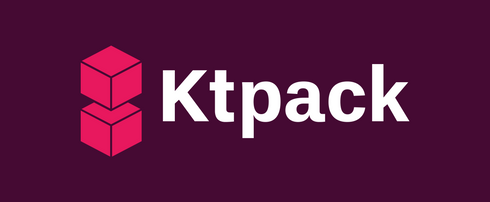

***WIP - Not ready for use!***

<h3 align="center">A simple tool for building and publishing Kotlin projects.</h3>

---

<a href="https://drewcarlson.github.io/ktpack/installation"><b>Installation</b></a> -
<a href="https://drewcarlson.github.io/ktpack/getting-started/"><b>Getting Started</b></a> -
<a href="https://drewcarlson.github.io/ktpack/"><b>Documentation</b></a> -
<a href="https://github.com/DrewCarlson/ktpack/releases/"><b>Releases</b></a>

---

### Overview

Ktpack is a build tool for [Kotlin Multiplatform](https://kotl.in/multiplatform) projects
providing a comprehensive set of features with one configuration file:

- Multiple binary application outputs and library modules
- Write tests and benchmarks inside or next to main source files
- Automatic Kotlin, JDK, and Nodejs toolchain management
- Consume Maven dependencies or [npm](https://www.npmjs.com/) dependencies
- Publishing to libraries to Maven and applications to Github

### License

The repository uses the MIT license, see [LICENSE](LICENSE).
